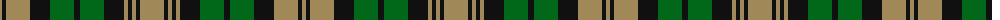

The parent of this is [Brown Watch (Fashion)](/tartans/lt/4/k4/lt24/k20/g24/k6/g24/k20/lt4/k4/lt4/k4/lt/24/)

This was sourced from tartans-authority.  It is a [13 stripes tartan](/stripes/stripes13/).

Original link http://www.tartansauthority.com/tartan-ferret/display/1739/

## Thread count
LT/4 K4 LT24 K20 G24 K6 G24 K20 LT4 K4 LT4 K4 LT/24

## Palette
Each colour and its ΔE from the base-6 reference it is a variant of.

| Colour | Shade | Base | ΔE (OKLab) |
|---|---|---|---|
| G |  `#006818` | G  | 0.02 |
| K |  `#101010` | K  | 0.17 |
| LT |  `#A08858` | Y  | 0.21 |

ID: /variants/lt/4/k4/lt24/k20/g24/k6/g24/k20/lt4/k4/lt4/k4/lt/24-g006818-k101010-lta08858/
