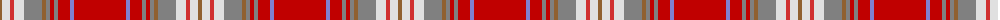

The parent of this is [Rathmore](/tartans/lt/4/ln8/r4/ln10/n18/lt4/n4/ra4/n4/ra12/b4/ra/52/)

This was sourced from weddslist.  It is a [12 stripes tartan](/stripes/stripes12/).

Original link http://www.weddslist.com/cgi-bin/tartans/pg.pl?source=sts

## Thread count
LT/4 LN8 R4 LN10 N18 LT4 N4 Ra4 N4 Ra12 B4 Ra/52

## Palette
Each colour and its ΔE from the base-6 reference it is a variant of.

| Colour | Shade | Base | ΔE (OKLab) |
|---|---|---|---|
| B |  `#8080D0` | B  | 0.24 |
| LN |  `#E0E0E0` | W  | 0.06 |
| LT |  `#906030` | R  | 0.15 |
| N |  `#808080` | G  | 0.22 |
| R |  `#D03030` | R  | 0.05 |
| Ra |  `#C00000` | R  | 0.02 |

ID: /variants/lt/4/ln8/r4/ln10/n18/lt4/n4/ra4/n4/ra12/b4/ra/52-b8080d0-lne0e0e0-lt906030-n808080-rd03030-rac00000/
