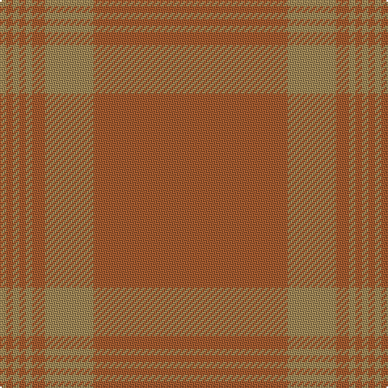

The parent of this is [Masai Shuka 09 (Artefact)](/tartans/lt/4/lta4/lt4/lta4/lt4/lta8/lt30/lta/120/)

This was sourced from tartans-authority.  It is a [8 stripes tartan](/stripes/stripes8/).

Original link http://www.tartansauthority.com/tartan-ferret/display/7200/

## Thread count
LT/4 LTa4 LT4 LTa4 LT4 LTa8 LT30 LTa/120

## Palette
Each colour and its ΔE from the base-6 reference it is a variant of.

| Colour | Shade | Base | ΔE (OKLab) |
|---|---|---|---|
| LT |  `#A08858` | Y  | 0.21 |
| LTa |  `#A45C30` | R  | 0.12 |

# Sample pattern

ID: /variants/lt/4/lta4/lt4/lta4/lt4/lta8/lt30/lta/120-lta08858-ltaa45c30/
