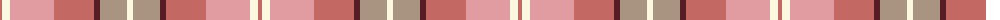
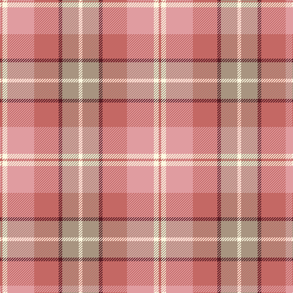

The parent of this is [Susan G Komen (Fashion)](/tartans/lt/4/ly8/lr44/lt40/dr6/n27/ly/6/)

This was sourced from tartans-authority.  It is a [7 stripes tartan](/stripes/stripes7/).

Original link http://www.tartansauthority.com/tartan-ferret/display/7332/

## Thread count
LT/4 LY8 LR44 LT40 DR6 N27 LY/6

## Palette
Each colour and its ΔE from the base-6 reference it is a variant of.

| Colour | Shade | Base | ΔE (OKLab) |
|---|---|---|---|
| DR |  `#581C24` | B  | 0.18 |
| LR |  `#E09CA0` | Y  | 0.18 |
| LT |  `#C46864` | R  | 0.14 |
| LY |  `#FCF8E0` | W  | 0.03 |
| N |  `#A89480` | Y  | 0.19 |

# Sample pattern

ID: /variants/lt/4/ly8/lr44/lt40/dr6/n27/ly/6-dr581c24-lre09ca0-ltc46864-lyfcf8e0-na89480/
