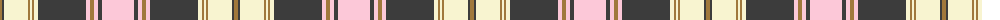

The parent of this is [Fiona (Fashion)](/tartans/lt/4/n2/ly24/lt2/ly2/lt2/ly4/n48/w4/lt4/w4/n4/w/32/)

This was sourced from tartans-authority.  It is a [13 stripes tartan](/stripes/stripes13/).

Original link http://www.tartansauthority.com/tartan-ferret/display/4861/

## Thread count
LT/4 N2 LY24 LT2 LY2 LT2 LY4 N48 W4 LT4 W4 N4 W/32

## Palette
Each colour and its ΔE from the base-6 reference it is a variant of.

| Colour | Shade | Base | ΔE (OKLab) |
|---|---|---|---|
| LT |  `#A0783C` | R  | 0.18 |
| LY |  `#F8F4D0` | W  | 0.04 |
| N |  `#3C3C3C` | B  | 0.12 |
| W |  `#FCC8D8` | W  | 0.11 |

ID: /variants/lt/4/n2/ly24/lt2/ly2/lt2/ly4/n48/w4/lt4/w4/n4/w/32-lta0783c-lyf8f4d0-n3c3c3c-wfcc8d8/
