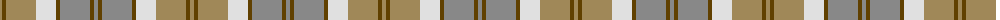
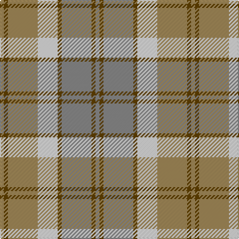

The parent of this is [Bannockbane Grey #2](/tartans/lt/4/t4/lt30/ln20/t4/n30/t4/n/4/)

This was sourced from register-of-tartans.  It is a [8 stripes tartan](/stripes/stripes8/).

Original link https://www.tartanregister.gov.uk/tartanDetails.aspx?ref=199

## Thread count
LT/4 T4 LT30 LN20 T4 N30 T4 N/4

## Palette
Each colour and its ΔE from the base-6 reference it is a variant of.

| Colour | Shade | Base | ΔE (OKLab) |
|---|---|---|---|
| LN |  `#E0E0E0` | W  | 0.06 |
| LT |  `#A08858` | Y  | 0.21 |
| N |  `#888888` | R  | 0.24 |
| T |  `#604000` | G  | 0.14 |

# Sample pattern

ID: /variants/lt/4/t4/lt30/ln20/t4/n30/t4/n/4-lne0e0e0-lta08858-n888888-t604000/
