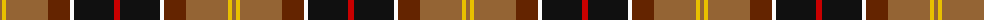
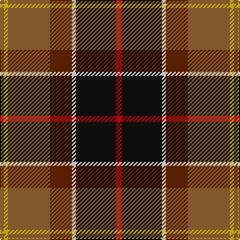

The parent of this is [Barbour](/tartans/lt/4/y4/lt42/t22/w4/k40/r/6/)

This was sourced from register-of-tartans.  It is a [7 stripes tartan](/stripes/stripes7/).

Original link https://www.tartanregister.gov.uk/tartanDetails.aspx?ref=212

## Thread count
LT/4 Y4 LT42 T22 W4 K40 R/6

## Palette
Each colour and its ΔE from the base-6 reference it is a variant of.

| Colour | Shade | Base | ΔE (OKLab) |
|---|---|---|---|
| K |  `#101010` | K  | 0.17 |
| LT |  `#946434` | R  | 0.15 |
| R |  `#C80000` | R  | 0.00 |
| T |  `#642400` | B  | 0.21 |
| W |  `#FCFCFC` | W  | 0.03 |
| Y |  `#E8C000` | Y  | 0.00 |

# Sample pattern

ID: /variants/lt/4/y4/lt42/t22/w4/k40/r/6-k101010-lt946434-rc80000-t642400-wfcfcfc-ye8c000/
