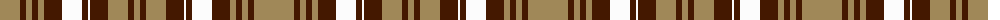

The parent of this is [Brown Watch Dress (Fashion)](/tartans/lt/40/dr6/lt6/dr6/lt6/dr18/w20/dr6/w2/dr18/lt20/dr6/lt/6/)

This was sourced from tartans-authority.  It is a [13 stripes tartan](/stripes/stripes13/).

Original link http://www.tartansauthority.com/tartan-ferret/display/1746/

## Thread count
LT/40 DR6 LT6 DR6 LT6 DR18 W20 DR6 W2 DR18 LT20 DR6 LT/6

## Palette
Each colour and its ΔE from the base-6 reference it is a variant of.

| Colour | Shade | Base | ΔE (OKLab) |
|---|---|---|---|
| DR |  `#441800` | B  | 0.22 |
| LT |  `#A08858` | Y  | 0.21 |
| W |  `#FCFCFC` | W  | 0.03 |

ID: /variants/lt/40/dr6/lt6/dr6/lt6/dr18/w20/dr6/w2/dr18/lt20/dr6/lt/6-dr441800-lta08858-wfcfcfc/
