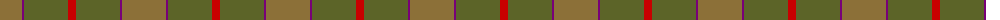
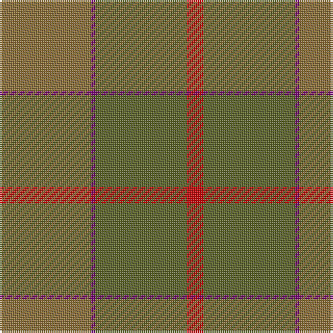

The parent of this is [McWilliams (2014)](/tartans/lt/44/p2/g44/r/8/)

This was sourced from tartans-authority.  It is a [4 stripes tartan](/stripes/stripes4/).

Original link http://www.tartansauthority.com/tartan-ferret/display/11134/

## Thread count
LT/44 P2 G44 R/8

## Palette
Each colour and its ΔE from the base-6 reference it is a variant of.

| Colour | Shade | Base | ΔE (OKLab) |
|---|---|---|---|
| G |  `#5C6428` | G  | 0.09 |
| LT |  `#8C7038` | G  | 0.18 |
| P |  `#780078` | B  | 0.16 |
| R |  `#C80000` | R  | 0.00 |

# Sample pattern

ID: /variants/lt/44/p2/g44/r/8-g5c6428-lt8c7038-p780078-rc80000/
