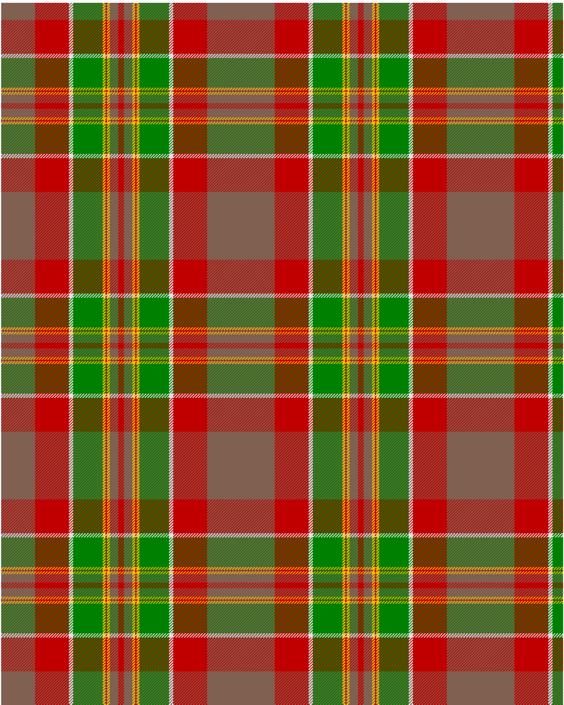

Henry, W.A.

This was sourced from <no value>.  It is a 9 stripes tartan.

Original link http://www.weddslist.com/cgi-bin/tartans/pg.pl?source=sts

## Thread count
LT/48 R48 LN6 G42 Y4 R2 Y4 LT12 R/4

## Palette
G#008000 LN#E0E0E0 LT#806050 R#C00000 Y#F0C000

# Sample pattern

ID: /variants/lt/48/r48/ln6/g42/y4/r2/y4/lt12/r/4-g008000-lne0e0e0-lt806050-rc00000-yf0c000