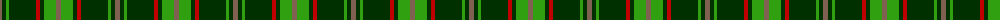
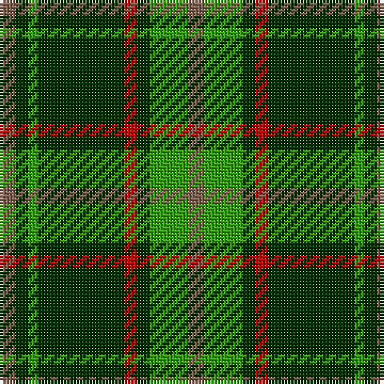

The parent of this is [Daks, Muted Loden](/tartans/lt/5/dg4/g3/dg27/r4/dg4/g12/lt/5/)

This was sourced from weddslist.  It is a [8 stripes tartan](/stripes/stripes8/).

Original link http://www.weddslist.com/cgi-bin/tartans/pg.pl?source=sts

## Thread count
LT/5 DG4 G3 DG27 R4 DG4 G12 LT/5

## Palette
Each colour and its ΔE from the base-6 reference it is a variant of.

| Colour | Shade | Base | ΔE (OKLab) |
|---|---|---|---|
| DG |  `#003000` | G  | 0.18 |
| G |  `#30A010` | G  | 0.19 |
| LT |  `#806050` | R  | 0.17 |
| R |  `#C00000` | R  | 0.02 |

# Sample pattern

ID: /variants/lt/5/dg4/g3/dg27/r4/dg4/g12/lt/5-dg003000-g30a010-lt806050-rc00000/
