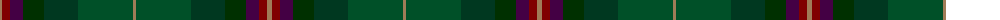

The parent of this is [Lunting Papi (Personal)](/tartans/lt/5/dr8/dp13/dga21/dg34/g55/lt/3/)

This was sourced from tartans-authority.  It is a [7 stripes tartan](/stripes/stripes7/).

Original link http://www.tartansauthority.com/tartan-ferret/display/7223/

## Thread count
LT/5 DR8 DP13 DGa21 DG34 G55 LT/3

## Palette
Each colour and its ΔE from the base-6 reference it is a variant of.

| Colour | Shade | Base | ΔE (OKLab) |
|---|---|---|---|
| DG |  `#003820` | G  | 0.16 |
| DGa |  `#003000` | G  | 0.18 |
| DP |  `#440044` | B  | 0.17 |
| DR |  `#800000` | R  | 0.16 |
| G |  `#005028` | G  | 0.08 |
| LT |  `#A07C58` | R  | 0.19 |

# Sample pattern

ID: /variants/lt/5/dr8/dp13/dga21/dg34/g55/lt/3-dg003820-dga003000-dp440044-dr800000-g005028-lta07c58/
