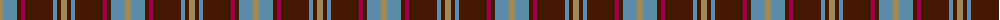
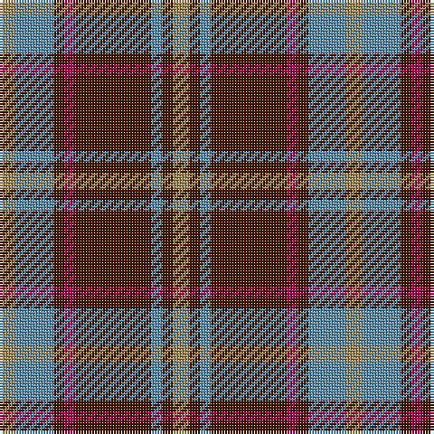

The parent of this is [Daks (Blue Loden)](/tartans/lt/6/b14/dr4/r4/dr28/b4/dr4/lt/6/)

This was sourced from register-of-tartans.  It is a [8 stripes tartan](/stripes/stripes8/).

Original link https://www.tartanregister.gov.uk/tartanDetails.aspx?ref=865

## Thread count
LT/6 B14 DR4 R4 DR28 B4 DR4 LT/6

## Palette
Each colour and its ΔE from the base-6 reference it is a variant of.

| Colour | Shade | Base | ΔE (OKLab) |
|---|---|---|---|
| B |  `#5C8CA8` | B  | 0.23 |
| DR |  `#441800` | B  | 0.22 |
| LT |  `#A08858` | Y  | 0.21 |
| R |  `#A00048` | R  | 0.11 |

# Sample pattern

ID: /variants/lt/6/b14/dr4/r4/dr28/b4/dr4/lt/6-b5c8ca8-dr441800-lta08858-ra00048/
