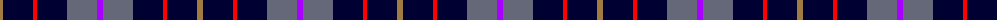
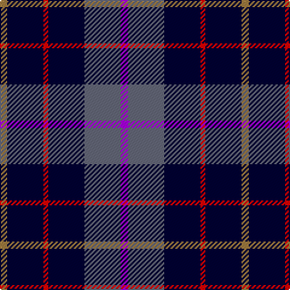

The parent of this is [H.M.S. DUNCAN](/tartans/lt/6/db30/r4/db30/n30/p/6/)

This was sourced from register-of-tartans.  It is a [6 stripes tartan](/stripes/stripes6/).

Original link https://www.tartanregister.gov.uk/tartanDetails.aspx?ref=10268

## Thread count
LT/6 DB30 R4 DB30 N30 P/6

## Palette
Each colour and its ΔE from the base-6 reference it is a variant of.

| Colour | Shade | Base | ΔE (OKLab) |
|---|---|---|---|
| DB |  `#000033` | K  | 0.18 |
| LT |  `#A07C40` | R  | 0.19 |
| N |  `#656879` | B  | 0.16 |
| P |  `#AA00FF` | B  | 0.29 |
| R |  `#FF0000` | R  | 0.11 |

# Sample pattern

ID: /variants/lt/6/db30/r4/db30/n30/p/6-db000033-lta07c40-n656879-paa00ff-rff0000/
