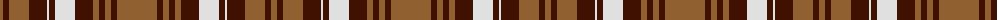

The parent of this is [Brown, Watch dress](/tartans/lt/6/dr6/lt20/dr18/ln2/dr6/ln20/dr18/lt6/dr6/lt6/dr6/lt/40/)

This was sourced from weddslist.  It is a [13 stripes tartan](/stripes/stripes13/).

Original link http://www.weddslist.com/cgi-bin/tartans/pg.pl?source=sts

## Thread count
LT/6 DR6 LT20 DR18 LN2 DR6 LN20 DR18 LT6 DR6 LT6 DR6 LT/40

## Palette
Each colour and its ΔE from the base-6 reference it is a variant of.

| Colour | Shade | Base | ΔE (OKLab) |
|---|---|---|---|
| DR |  `#401000` | B  | 0.23 |
| LN |  `#E0E0E0` | W  | 0.06 |
| LT |  `#906030` | R  | 0.15 |

ID: /variants/lt/6/dr6/lt20/dr18/ln2/dr6/ln20/dr18/lt6/dr6/lt6/dr6/lt/40-dr401000-lne0e0e0-lt906030/
