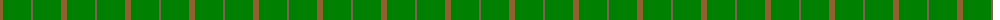
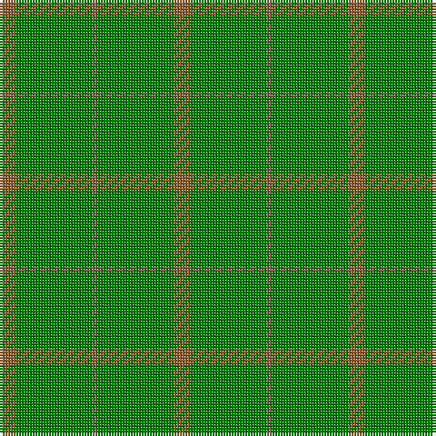

The parent of this is [Pearson](/tartans/lt/6/g28/lta2/g28/lt/6/)

This was sourced from weddslist.  It is a [5 stripes tartan](/stripes/stripes5/).

Original link http://www.weddslist.com/cgi-bin/tartans/pg.pl?source=sts

## Thread count
LT/6 G28 LTa2 G28 LT/6

## Palette
Each colour and its ΔE from the base-6 reference it is a variant of.

| Colour | Shade | Base | ΔE (OKLab) |
|---|---|---|---|
| G |  `#008000` | G  | 0.09 |
| LT |  `#906030` | R  | 0.15 |
| LTa |  `#806050` | R  | 0.17 |

# Sample pattern

ID: /variants/lt/6/g28/lta2/g28/lt/6-g008000-lt906030-lta806050/
