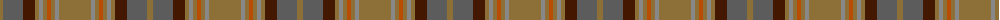

The parent of this is [Annan (Fashion)](/tartans/lt/6/n20/dr12/lt4/na4/lt4/do4/lt4/na4/lt/32/)

This was sourced from tartans-authority.  It is a [10 stripes tartan](/stripes/stripes10/).

Original link http://www.tartansauthority.com/tartan-ferret/display/1742/

## Thread count
LT/6 N20 DR12 LT4 Na4 LT4 DO4 LT4 Na4 LT/32

## Palette
Each colour and its ΔE from the base-6 reference it is a variant of.

| Colour | Shade | Base | ΔE (OKLab) |
|---|---|---|---|
| DO |  `#B84C00` | R  | 0.08 |
| DR |  `#441800` | B  | 0.22 |
| LT |  `#8C7038` | G  | 0.18 |
| N |  `#5C5C5C` | B  | 0.14 |
| Na |  `#888888` | R  | 0.24 |

ID: /variants/lt/6/n20/dr12/lt4/na4/lt4/do4/lt4/na4/lt/32-dob84c00-dr441800-lt8c7038-n5c5c5c-na888888/
