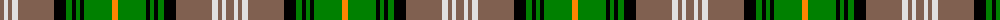

The parent of this is [Dorcas, Check](/tartans/lt/8/ln4/lt4/ln6/lt36/k12/g6/k4/g4/k4/g28/o/6/)

This was sourced from weddslist.  It is a [12 stripes tartan](/stripes/stripes12/).

Original link http://www.weddslist.com/cgi-bin/tartans/pg.pl?source=sts

## Thread count
LT/8 LN4 LT4 LN6 LT36 K12 G6 K4 G4 K4 G28 O/6

## Palette
Each colour and its ΔE from the base-6 reference it is a variant of.

| Colour | Shade | Base | ΔE (OKLab) |
|---|---|---|---|
| G |  `#008000` | G  | 0.09 |
| K |  `#000000` | K  | 0.00 |
| LN |  `#E0E0E0` | W  | 0.06 |
| LT |  `#806050` | R  | 0.17 |
| O |  `#FF8500` | Y  | 0.14 |

ID: /variants/lt/8/ln4/lt4/ln6/lt36/k12/g6/k4/g4/k4/g28/o/6-g008000-k000000-lne0e0e0-lt806050-off8500/
