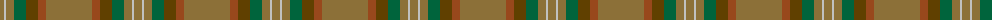
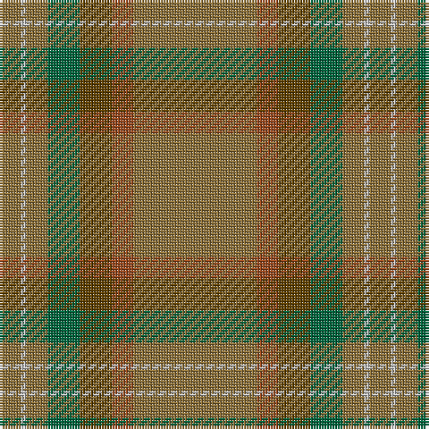

The parent of this is [Tricor (Corporate)](/tartans/lt/8/n2/lt8/g12/t12/ta8/lt/46/)

This was sourced from tartans-authority.  It is a [7 stripes tartan](/stripes/stripes7/).

Original link http://www.tartansauthority.com/tartan-ferret/display/5823/

## Thread count
LT/8 N2 LT8 G12 T12 Ta8 LT/46

## Palette
Each colour and its ΔE from the base-6 reference it is a variant of.

| Colour | Shade | Base | ΔE (OKLab) |
|---|---|---|---|
| G |  `#00643C` | G  | 0.06 |
| LT |  `#8C7038` | G  | 0.18 |
| N |  `#C0C0C0` | W  | 0.16 |
| T |  `#604000` | G  | 0.14 |
| Ta |  `#98481C` | R  | 0.11 |

# Sample pattern

ID: /variants/lt/8/n2/lt8/g12/t12/ta8/lt/46-g00643c-lt8c7038-nc0c0c0-t604000-ta98481c/
