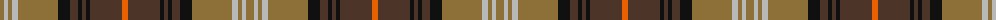

The parent of this is [Scotch House 'Dorcas' (Fashion)](/tartans/lt/8/n4/lt4/n6/lt40/k12/t8/k4/t4/k4/t32/o/6/)

This was sourced from tartans-authority.  It is a [12 stripes tartan](/stripes/stripes12/).

Original link http://www.tartansauthority.com/tartan-ferret/display/1315/

## Thread count
LT/8 N4 LT4 N6 LT40 K12 T8 K4 T4 K4 T32 O/6

## Palette
Each colour and its ΔE from the base-6 reference it is a variant of.

| Colour | Shade | Base | ΔE (OKLab) |
|---|---|---|---|
| K |  `#101010` | K  | 0.17 |
| LT |  `#8C7038` | G  | 0.18 |
| N |  `#B8B8B8` | Y  | 0.17 |
| O |  `#E86000` | R  | 0.14 |
| T |  `#4C3428` | B  | 0.16 |

ID: /variants/lt/8/n4/lt4/n6/lt40/k12/t8/k4/t4/k4/t32/o/6-k101010-lt8c7038-nb8b8b8-oe86000-t4c3428/
