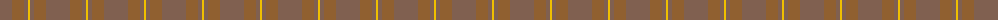
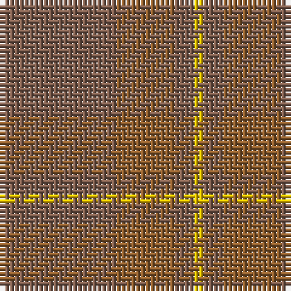

The parent of this is [Loch Garth](/tartans/lta/24/lt12/lta4/y/2/)

This was sourced from weddslist.  It is a [4 stripes tartan](/stripes/stripes4/).

Original link http://www.weddslist.com/cgi-bin/tartans/pg.pl?source=sts

## Thread count
LTa/24 LT12 LTa4 Y/2

## Palette
Each colour and its ΔE from the base-6 reference it is a variant of.

| Colour | Shade | Base | ΔE (OKLab) |
|---|---|---|---|
| LT |  `#906030` | R  | 0.15 |
| LTa |  `#806050` | R  | 0.17 |
| Y |  `#F0C000` | Y  | 0.01 |

# Sample pattern

ID: /variants/lta/24/lt12/lta4/y/2-lt906030-lta806050-yf0c000/
