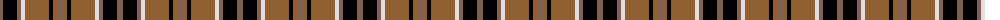
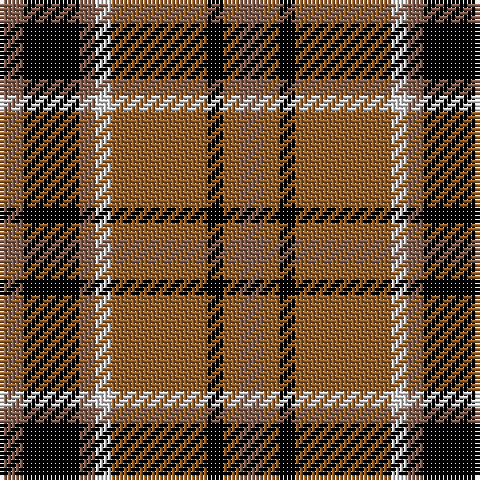

The parent of this is [Daks](/tartans/lta/6/k14/lta4/ln4/lt24/k4/lt4/lta/6/)

This was sourced from weddslist.  It is a [8 stripes tartan](/stripes/stripes8/).

Original link http://www.weddslist.com/cgi-bin/tartans/pg.pl?source=sts

## Thread count
LTa/6 K14 LTa4 LN4 LT24 K4 LT4 LTa/6

## Palette
Each colour and its ΔE from the base-6 reference it is a variant of.

| Colour | Shade | Base | ΔE (OKLab) |
|---|---|---|---|
| K |  `#000000` | K  | 0.00 |
| LN |  `#E0E0E0` | W  | 0.06 |
| LT |  `#906030` | R  | 0.15 |
| LTa |  `#806050` | R  | 0.17 |

# Sample pattern

ID: /variants/lta/6/k14/lta4/ln4/lt24/k4/lt4/lta/6-k000000-lne0e0e0-lt906030-lta806050/
