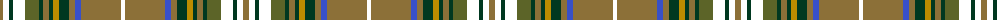

The parent of this is [Stewart Camel Fashion Tartan Tartan Number: 4038. Earliest known date: 01/01/1999 No Details See products available Copyright © Blair Urquhart, Comrie, 2015](/tartans/lta/6/ot6/dg4/ot12/g14/dg4/lta6/dg4/dy6/dg10/lta6/b6/lta40/ot/4/)

This was sourced from house-of-tartan.  It is a [14 stripes tartan](/stripes/stripes14/).

Original link http://www.house-of-tartan.scotland.net/house/TartanViewjs.asp?colr=Def&tnam=4038

## Thread count
LTa/6 OT6 DG4 OT12 G14 DG4 LTa6 DG4 DY6 DG10 LTa6 B6 LTa40 OT/4

## Palette
Each colour and its ΔE from the base-6 reference it is a variant of.

| Colour | Shade | Base | ΔE (OKLab) |
|---|---|---|---|
| B |  `#3850C8` | B  | 0.12 |
| DG |  `#003820` | G  | 0.16 |
| DY |  `#BC8C00` | Y  | 0.16 |
| G |  `#5C6428` | G  | 0.09 |
| LN |  `#E0E0E0` | W  | 0.06 |
| LT |  `#A08858` | Y  | 0.21 |
| LTa |  `#8C7038` | G  | 0.18 |

ID: /variants/lta/6/ot6/dg4/ot12/g14/dg4/lta6/dg4/dy6/dg10/lta6/b6/lta40/ot/4-b3850c8-dg003820-dybc8c00-g5c6428-lne0e0e0-lta08858-lta8c7038/
