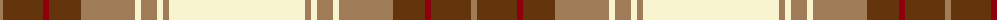

The parent of this is [Ben Cleuch](/tartans/lta/6/t40/dr6/t32/lta54/ly6/lta16/ly6/lta6/ly/136/)

This was sourced from register-of-tartans.  It is a [10 stripes tartan](/stripes/stripes10/).

Original link https://www.tartanregister.gov.uk/tartanDetails.aspx?ref=5306

## Thread count
LTa/6 T40 DR6 T32 LTa54 LY6 LTa16 LY6 LTa6 LY/136

## Palette
Each colour and its ΔE from the base-6 reference it is a variant of.

| Colour | Shade | Base | ΔE (OKLab) |
|---|---|---|---|
| DR |  `#90000C` | R  | 0.12 |
| K |  `#3C2010` | B  | 0.20 |
| LT |  `#B07430` | R  | 0.17 |
| LTa |  `#A07C58` | R  | 0.19 |
| LY |  `#F8F4D0` | W  | 0.04 |
| T |  `#64340C` | G  | 0.18 |

ID: /variants/lta/6/t40/dr6/t32/lta54/ly6/lta16/ly6/lta6/ly/136-dr90000c-k3c2010-ltb07430-ltaa07c58-lyf8f4d0-t64340c/
