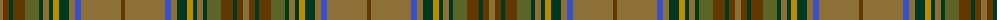

The parent of this is [Stewart Camel (Lochcarron)](/tartans/lta/6/t6/dg4/t12/g14/dg4/lta6/dg4/dy6/dg10/lta6/b6/lta40/t/4/)

This was sourced from register-of-tartans.  It is a [14 stripes tartan](/stripes/stripes14/).

Original link https://www.tartanregister.gov.uk/tartanDetails.aspx?ref=3933

## Thread count
LTa/6 T6 DG4 T12 G14 DG4 LTa6 DG4 DY6 DG10 LTa6 B6 LTa40 T/4

## Palette
Each colour and its ΔE from the base-6 reference it is a variant of.

| Colour | Shade | Base | ΔE (OKLab) |
|---|---|---|---|
| B |  `#3850C8` | B  | 0.12 |
| DG |  `#003820` | G  | 0.16 |
| DY |  `#BC8C00` | Y  | 0.16 |
| G |  `#5C6428` | G  | 0.09 |
| LN |  `#E0E0E0` | W  | 0.06 |
| LT |  `#A08858` | Y  | 0.21 |
| LTa |  `#8C7038` | G  | 0.18 |
| T |  `#603800` | G  | 0.16 |

ID: /variants/lta/6/t6/dg4/t12/g14/dg4/lta6/dg4/dy6/dg10/lta6/b6/lta40/t/4-b3850c8-dg003820-dybc8c00-g5c6428-lne0e0e0-lta08858-lta8c7038-t603800/
