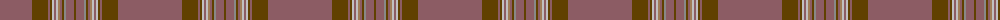

The parent of this is [Parma (Fashion)](/tartans/lta/64/t16/lta2/t2/n2/lta2/n2/lt2/lta2/t2/na2/lta8/t/2/)

This was sourced from tartans-authority.  It is a [13 stripes tartan](/stripes/stripes13/).

Original link http://www.tartansauthority.com/tartan-ferret/display/5516/

## Thread count
LTa/64 T16 LTa2 T2 N2 LTa2 N2 LT2 LTa2 T2 Na2 LTa8 T/2

## Palette
Each colour and its ΔE from the base-6 reference it is a variant of.

| Colour | Shade | Base | ΔE (OKLab) |
|---|---|---|---|
| LT |  `#A07C58` | R  | 0.19 |
| LTa |  `#8C5C64` | R  | 0.16 |
| N |  `#C0C0C0` | W  | 0.16 |
| Na |  `#888888` | R  | 0.24 |
| T |  `#604000` | G  | 0.14 |

ID: /variants/lta/64/t16/lta2/t2/n2/lta2/n2/lt2/lta2/t2/na2/lta8/t/2-lta07c58-lta8c5c64-nc0c0c0-na888888-t604000/
