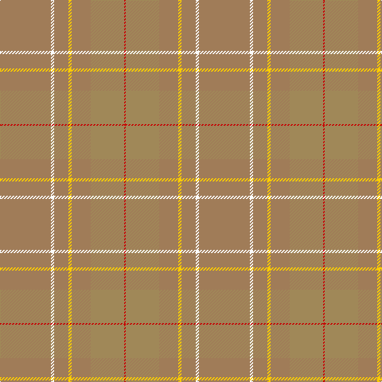

The parent of this is [Weathered Cyclist (Corporate)](/tartans/lta/64/w4/lta18/y4/lta24/lt42/r/2/)

This was sourced from tartans-authority.  It is a [7 stripes tartan](/stripes/stripes7/).

Original link http://www.tartansauthority.com/tartan-ferret/display/10732/

## Thread count
LTa/64 W4 LTa18 Y4 LTa24 LT42 R/2

## Palette
Each colour and its ΔE from the base-6 reference it is a variant of.

| Colour | Shade | Base | ΔE (OKLab) |
|---|---|---|---|
| LT |  `#A08858` | Y  | 0.21 |
| LTa |  `#A07C58` | R  | 0.19 |
| R |  `#C80000` | R  | 0.00 |
| W |  `#FCFCFC` | W  | 0.03 |
| Y |  `#FCCC00` | Y  | 0.04 |

# Sample pattern

ID: /variants/lta/64/w4/lta18/y4/lta24/lt42/r/2-lta08858-ltaa07c58-rc80000-wfcfcfc-yfccc00/
