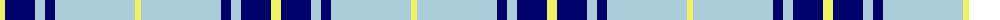
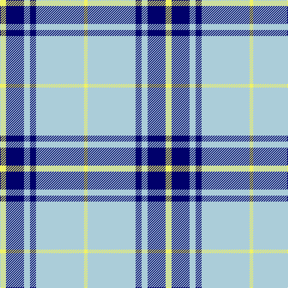

The parent of this is [Legary](/tartans/ly/10/db30/lb10/db10/lb80/ly/6/)

This was sourced from register-of-tartans.  It is a [6 stripes tartan](/stripes/stripes6/).

Original link https://www.tartanregister.gov.uk/tartanDetails.aspx?ref=10041

## Thread count
LY/10 DB30 LB10 DB10 LB80 LY/6

## Palette
Each colour and its ΔE from the base-6 reference it is a variant of.

| Colour | Shade | Base | ΔE (OKLab) |
|---|---|---|---|
| DB |  `#00006B` | B  | 0.16 |
| LB |  `#ABCDD9` | W  | 0.15 |
| LY |  `#EFF265` | Y  | 0.12 |

# Sample pattern

ID: /variants/ly/10/db30/lb10/db10/lb80/ly/6-db00006b-lbabcdd9-lyeff265/
