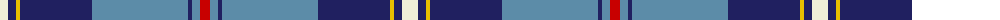

The parent of this is [MacRaes of America](/tartans/ly/16/db8/y4/db72/b96/db4/b8/r/10/)

This was sourced from tartans-authority.  It is a [8 stripes tartan](/stripes/stripes8/).

Original link http://www.tartansauthority.com/tartan-ferret/display/7304/

## Thread count
LY/16 DB8 Y4 DB72 B96 DB4 B8 R/10

## Palette
Each colour and its ΔE from the base-6 reference it is a variant of.

| Colour | Shade | Base | ΔE (OKLab) |
|---|---|---|---|
| B |  `#5C8CA8` | B  | 0.23 |
| DB |  `#202060` | B  | 0.11 |
| LY |  `#F0F0D8` | W  | 0.03 |
| R |  `#C80000` | R  | 0.00 |
| Y |  `#E8C000` | Y  | 0.00 |

# Sample pattern

ID: /variants/ly/16/db8/y4/db72/b96/db4/b8/r/10-b5c8ca8-db202060-lyf0f0d8-rc80000-ye8c000/
