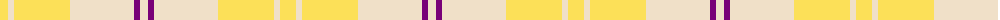
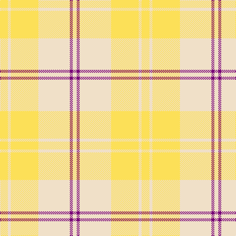

The parent of this is [Ailsa Yellow Fashion Tartan Tartan Number: 7604. Earliest known date: March 2008 One of a series of dancer's tartans for the House of Edgar's in-house collection designed by Kirsty Anderson. See products available Copyright © Blair Urquhart, Comrie, 2015](/tartans/ly/16/w6/ly56/w64/p6/w/8/)

This was sourced from house-of-tartan.  It is a [6 stripes tartan](/stripes/stripes6/).

Original link http://www.house-of-tartan.scotland.net/house/TartanViewjs.asp?colr=Def&tnam=7604

## Thread count
LY/16 W6 LY56 W64 P6 W/8

## Palette
Each colour and its ΔE from the base-6 reference it is a variant of.

| Colour | Shade | Base | ΔE (OKLab) |
|---|---|---|---|
| LY |  `#FCE058` | Y  | 0.09 |
| P |  `#780078` | B  | 0.16 |
| W |  `#F0E0C8` | W  | 0.06 |

# Sample pattern

ID: /variants/ly/16/w6/ly56/w64/p6/w/8-lyfce058-p780078-wf0e0c8/
