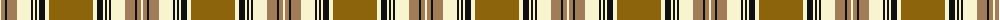

The parent of this is [Waverley Check (Corporate)](/tartans/ly/2/lt4/k2/lt10/ly14/k2/ly2/k2/ly2/k6/ly4/t/44/)

This was sourced from tartans-authority.  It is a [12 stripes tartan](/stripes/stripes12/).

Original link http://www.tartansauthority.com/tartan-ferret/display/1747/

## Thread count
LY/2 LT4 K2 LT10 LY14 K2 LY2 K2 LY2 K6 LY4 T/44

## Palette
Each colour and its ΔE from the base-6 reference it is a variant of.

| Colour | Shade | Base | ΔE (OKLab) |
|---|---|---|---|
| K |  `#101010` | K  | 0.17 |
| LT |  `#A07C58` | R  | 0.19 |
| LY |  `#F8F4D0` | W  | 0.04 |
| T |  `#8C640C` | G  | 0.17 |

ID: /variants/ly/2/lt4/k2/lt10/ly14/k2/ly2/k2/ly2/k6/ly4/t/44-k101010-lta07c58-lyf8f4d0-t8c640c/
