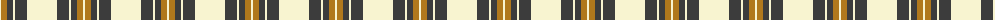
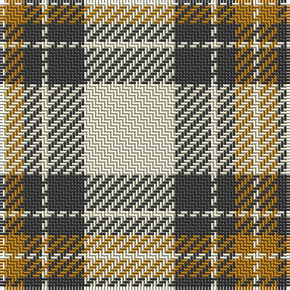

The parent of this is [Burns (Fashion)](/tartans/ly/2/lt6/n6/ly2/n12/ly/30/)

This was sourced from tartans-authority.  It is a [6 stripes tartan](/stripes/stripes6/).

Original link http://www.tartansauthority.com/tartan-ferret/display/3774/

## Thread count
LY/2 LT6 N6 LY2 N12 LY/30

## Palette
Each colour and its ΔE from the base-6 reference it is a variant of.

| Colour | Shade | Base | ΔE (OKLab) |
|---|---|---|---|
| LT |  `#B0781C` | R  | 0.18 |
| LY |  `#F8F4D0` | W  | 0.04 |
| N |  `#3C3C3C` | B  | 0.12 |

# Sample pattern

ID: /variants/ly/2/lt6/n6/ly2/n12/ly/30-ltb0781c-lyf8f4d0-n3c3c3c/
