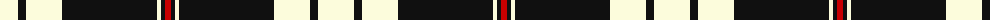

The parent of this is [Gretna Football Club (Corporate)](/tartans/ly/36/k8/ly36/k95/ly4/k4/r/6/)

This was sourced from tartans-authority.  It is a [7 stripes tartan](/stripes/stripes7/).

Original link http://www.tartansauthority.com/tartan-ferret/display/6841/

## Thread count
LY/36 K8 LY36 K95 LY4 K4 R/6

## Palette
Each colour and its ΔE from the base-6 reference it is a variant of.

| Colour | Shade | Base | ΔE (OKLab) |
|---|---|---|---|
| K |  `#101010` | K  | 0.17 |
| LY |  `#FCFCDC` | W  | 0.04 |
| R |  `#C80000` | R  | 0.00 |

# Sample pattern

ID: /variants/ly/36/k8/ly36/k95/ly4/k4/r/6-k101010-lyfcfcdc-rc80000/
