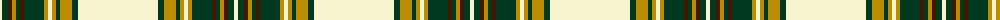

The parent of this is [Arbutus](/tartans/ly/4/dg6/dr4/dy4/dg4/dr4/dg20/dy4/ly4/dy4/dg4/dy12/dg6/ly/80/)

This was sourced from register-of-tartans.  It is a [14 stripes tartan](/stripes/stripes14/).

Original link https://www.tartanregister.gov.uk/tartanDetails.aspx?ref=5037

## Thread count
LY/4 DG6 DR4 DY4 DG4 DR4 DG20 DY4 LY4 DY4 DG4 DY12 DG6 LY/80

## Palette
Each colour and its ΔE from the base-6 reference it is a variant of.

| Colour | Shade | Base | ΔE (OKLab) |
|---|---|---|---|
| DG |  `#003820` | G  | 0.16 |
| DR |  `#441800` | B  | 0.22 |
| DY |  `#BC8C00` | Y  | 0.16 |
| G |  `#006818` | G  | 0.02 |
| LY |  `#F8F4D0` | W  | 0.04 |

ID: /variants/ly/4/dg6/dr4/dy4/dg4/dr4/dg20/dy4/ly4/dy4/dg4/dy12/dg6/ly/80-dg003820-dr441800-dybc8c00-g006818-lyf8f4d0/
