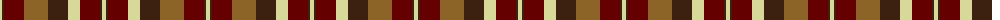

The parent of this is [Highland Village](/tartans/ly/4/k2/dr20/lt24/k20/ly12/dr20/k2/ly/4/)

This was sourced from register-of-tartans.  It is a [9 stripes tartan](/stripes/stripes9/).

Original link https://www.tartanregister.gov.uk/tartanDetails.aspx?ref=1724

## Thread count
LY/4 K2 DR20 LT24 K20 LY12 DR20 K2 LY/4

## Palette
Each colour and its ΔE from the base-6 reference it is a variant of.

| Colour | Shade | Base | ΔE (OKLab) |
|---|---|---|---|
| DR |  `#640000` | R  | 0.22 |
| K |  `#3C2010` | B  | 0.20 |
| LT |  `#8C6428` | R  | 0.16 |
| LY |  `#D8D898` | Y  | 0.10 |

ID: /variants/ly/4/k2/dr20/lt24/k20/ly12/dr20/k2/ly/4-dr640000-k3c2010-lt8c6428-lyd8d898/
