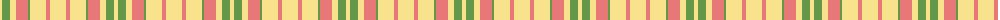
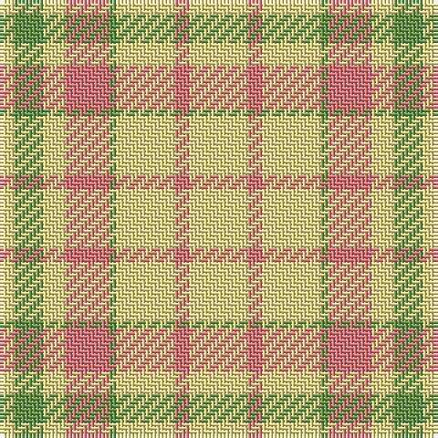

The parent of this is [Glufree](/tartans/ly/4/lg8/ly6/lr12/lg2/ly16/lr4/ly/16/)

This was sourced from register-of-tartans.  It is a [8 stripes tartan](/stripes/stripes8/).

Original link https://www.tartanregister.gov.uk/tartanDetails.aspx?ref=11299

## Thread count
LY/4 LG8 LY6 LR12 LG2 LY16 LR4 LY/16

## Palette
Each colour and its ΔE from the base-6 reference it is a variant of.

| Colour | Shade | Base | ΔE (OKLab) |
|---|---|---|---|
| LG |  `#649848` | G  | 0.19 |
| LR |  `#E87878` | R  | 0.19 |
| LY |  `#F8E38C` | Y  | 0.11 |

# Sample pattern

ID: /variants/ly/4/lg8/ly6/lr12/lg2/ly16/lr4/ly/16-lg649848-lre87878-lyf8e38c/
