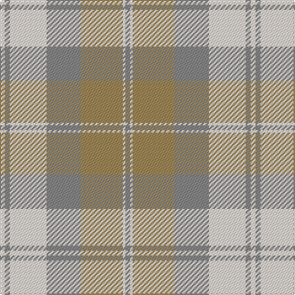

The parent of this is [NASSA (Corporate)](/tartans/ly/4/n4/ly30/n28/lt34/ly2/n/4/)

This was sourced from tartans-authority.  It is a [7 stripes tartan](/stripes/stripes7/).

Original link http://www.tartansauthority.com/tartan-ferret/display/7097/

## Thread count
LY/4 N4 LY30 N28 LT34 LY2 N/4

## Palette
Each colour and its ΔE from the base-6 reference it is a variant of.

| Colour | Shade | Base | ΔE (OKLab) |
|---|---|---|---|
| LT |  `#A08858` | Y  | 0.21 |
| LY |  `#F8E8D8` | W  | 0.04 |
| N |  `#888888` | R  | 0.24 |

# Sample pattern

ID: /variants/ly/4/n4/ly30/n28/lt34/ly2/n/4-lta08858-lyf8e8d8-n888888/
