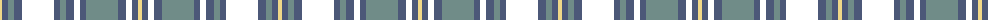

The parent of this is [Kerry Irish County Tartan Tartan Number: 2263. Earliest known date: 1993 One of a series of Irish District tartans designed by Polly Wittering of the House of Edgar, with colours reminiscent of the Country with soft warm colours dominating.. See products available Copyright © Blair Urquhart, Comrie, 2015](/tartans/ly/4/n6/lg6/n8/lut32/n6/lg6/n8/lut6/n6/lg32/n8/lut6/n6/ly/4/)

This was sourced from house-of-tartan.  It is a [15 stripes tartan](/stripes/stripes15/).

Original link http://www.house-of-tartan.scotland.net/house/TartanViewjs.asp?colr=Def&tnam=2263

## Thread count
LY/4 N6 LG6 N8 LUT32 N6 LG6 N8 LUT6 N6 LG32 N8 LUT6 N6 LY/4

## Palette
Each colour and its ΔE from the base-6 reference it is a variant of.

| Colour | Shade | Base | ΔE (OKLab) |
|---|---|---|---|
| LG |  `#708C88` | G  | 0.22 |
| LY |  `#F0D888` | Y  | 0.09 |
| N |  `#4C5878` | B  | 0.09 |

ID: /variants/ly/4/n6/lg6/n8/lut32/n6/lg6/n8/lut6/n6/lg32/n8/lut6/n6/ly/4-lg708c88-lyf0d888-n4c5878/
