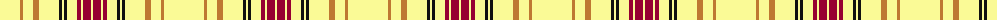

The parent of this is [Virginia Quadricentennial](/tartans/ly/40/do3/ly10/do6/ly20/k3/ly2/k3/ly10/dr4/ly2/dr8/ly/2/)

This was sourced from register-of-tartans.  It is a [13 stripes tartan](/stripes/stripes13/).

Original link https://www.tartanregister.gov.uk/tartanDetails.aspx?ref=4468

## Thread count
LY/40 DO3 LY10 DO6 LY20 K3 LY2 K3 LY10 DR4 LY2 DR8 LY/2

## Palette
Each colour and its ΔE from the base-6 reference it is a variant of.

| Colour | Shade | Base | ΔE (OKLab) |
|---|---|---|---|
| DO |  `#BE7832` | R  | 0.17 |
| DR |  `#960032` | R  | 0.12 |
| K |  `#101010` | K  | 0.17 |
| LY |  `#FAFA96` | W  | 0.12 |

ID: /variants/ly/40/do3/ly10/do6/ly20/k3/ly2/k3/ly10/dr4/ly2/dr8/ly/2-dobe7832-dr960032-k101010-lyfafa96/
