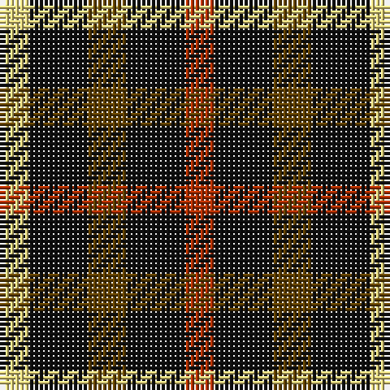

The parent of this is [Daks, Black (Fashion)](/tartans/ly/6/k12/t8/k12/r/6/)

This was sourced from tartans-authority.  It is a [5 stripes tartan](/stripes/stripes5/).

Original link http://www.tartansauthority.com/tartan-ferret/display/2631/

## Thread count
LY/6 K12 T8 K12 R/6

## Palette
Each colour and its ΔE from the base-6 reference it is a variant of.

| Colour | Shade | Base | ΔE (OKLab) |
|---|---|---|---|
| K |  `#101010` | K  | 0.17 |
| LY |  `#E8D880` | Y  | 0.08 |
| R |  `#B03000` | R  | 0.05 |
| T |  `#604000` | G  | 0.14 |

# Sample pattern

ID: /variants/ly/6/k12/t8/k12/r/6-k101010-lye8d880-rb03000-t604000/
