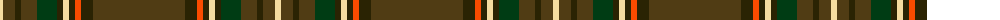

The parent of this is [Williams](/tartans/ly/6/t12/k6/t16/dg20/k6/ly6/k6/r6/k12/t/92/)

This was sourced from register-of-tartans.  It is a [11 stripes tartan](/stripes/stripes11/).

Original link https://www.tartanregister.gov.uk/tartanDetails.aspx?ref=4626

## Thread count
LY/6 T12 K6 T16 DG20 K6 LY6 K6 R6 K12 T/92

## Palette
Each colour and its ΔE from the base-6 reference it is a variant of.

| Colour | Shade | Base | ΔE (OKLab) |
|---|---|---|---|
| DG |  `#003C14` | G  | 0.14 |
| K |  `#2A2303` | B  | 0.21 |
| LY |  `#F5DCA0` | W  | 0.10 |
| R |  `#FA4B00` | R  | 0.14 |
| T |  `#503C14` | G  | 0.15 |

ID: /variants/ly/6/t12/k6/t16/dg20/k6/ly6/k6/r6/k12/t/92-dg003c14-k2a2303-lyf5dca0-rfa4b00-t503c14/
