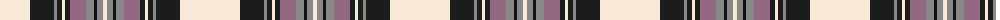

The parent of this is [Glenmore, Pink (Fashion)](/tartans/ly/60/k24/na3/k5/ly3/k5/n16/na8/ka3/na6/ly/4/)

This was sourced from tartans-authority.  It is a [11 stripes tartan](/stripes/stripes11/).

Original link http://www.tartansauthority.com/tartan-ferret/display/5042/

## Thread count
LY/60 K24 Na3 K5 LY3 K5 N16 Na8 Ka3 Na6 LY/4

## Palette
Each colour and its ΔE from the base-6 reference it is a variant of.

| Colour | Shade | Base | ΔE (OKLab) |
|---|---|---|---|
| K |  `#1C1C1C` | B  | 0.20 |
| Ka |  `#101010` | K  | 0.17 |
| LY |  `#F8E8D8` | W  | 0.04 |
| N |  `#946880` | R  | 0.18 |
| Na |  `#888888` | R  | 0.24 |

ID: /variants/ly/60/k24/na3/k5/ly3/k5/n16/na8/ka3/na6/ly/4-k1c1c1c-ka101010-lyf8e8d8-n946880-na888888/
