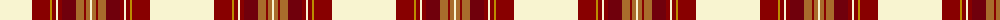

The parent of this is [Canna (Fashion)](/tartans/ly/64/dr18/dy2/dr4/ly2/dr4/dra14/lt8/dr2/lt4/ly/2/)

This was sourced from tartans-authority.  It is a [11 stripes tartan](/stripes/stripes11/).

Original link http://www.tartansauthority.com/tartan-ferret/display/4451/

## Thread count
LY/64 DR18 DY2 DR4 LY2 DR4 DRa14 LT8 DR2 LT4 LY/2

## Palette
Each colour and its ΔE from the base-6 reference it is a variant of.

| Colour | Shade | Base | ΔE (OKLab) |
|---|---|---|---|
| DR |  `#880000` | R  | 0.14 |
| DRa |  `#70000C` | R  | 0.20 |
| DY |  `#BC8C00` | Y  | 0.16 |
| LT |  `#A86C2C` | R  | 0.15 |
| LY |  `#F8F4D0` | W  | 0.04 |

ID: /variants/ly/64/dr18/dy2/dr4/ly2/dr4/dra14/lt8/dr2/lt4/ly/2-dr880000-dra70000c-dybc8c00-lta86c2c-lyf8f4d0/
