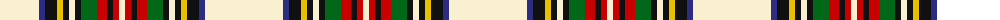

The parent of this is [Stewart Dress (Clan)](/tartans/ly/78/db6/k12/y6/k6/ly6/k6/g16/r10/k6/r6/ly/6/)

This was sourced from tartans-authority.  It is a [12 stripes tartan](/stripes/stripes12/).

Original link http://www.tartansauthority.com/tartan-ferret/display/1765/

## Thread count
LY/78 DB6 K12 Y6 K6 LY6 K6 G16 R10 K6 R6 LY/6

## Palette
Each colour and its ΔE from the base-6 reference it is a variant of.

| Colour | Shade | Base | ΔE (OKLab) |
|---|---|---|---|
| DB |  `#2C2C80` | B  | 0.05 |
| G |  `#006818` | G  | 0.02 |
| K |  `#101010` | K  | 0.17 |
| LY |  `#F8F0D0` | W  | 0.04 |
| R |  `#C80000` | R  | 0.00 |
| Y |  `#E8C000` | Y  | 0.00 |

ID: /variants/ly/78/db6/k12/y6/k6/ly6/k6/g16/r10/k6/r6/ly/6-db2c2c80-g006818-k101010-lyf8f0d0-rc80000-ye8c000/
