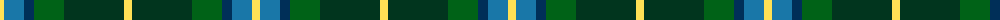
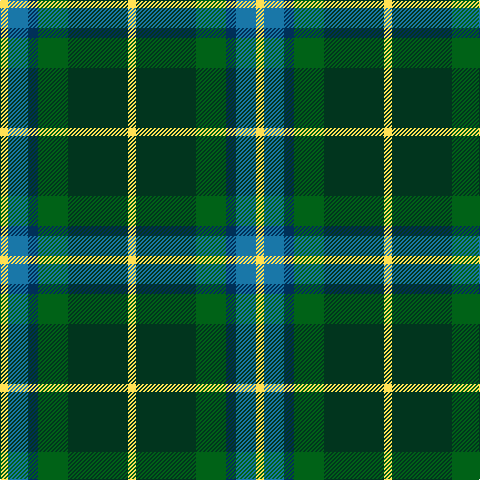

The parent of this is [MPS Emerald Society NCLEES 2012 Commemorative Tartan Tartan Number: 10711. Earliest known date: 5 October 2012 The Metropolitan Police Emerald Society was formed in 2005 and was the first law enforcement organisation from outside North America to be admitted to membership of NCLEES (National Conference of Law Enforcement Emerald Societies). During October 2012 in London, the MPS Emerald Society hosted the annual NCLEES Conference, the first time the conference has been held outside the USA. The Metropolitan Police Emerald Society tartan was designed to commemorate this historic occasion. Colours: two shades of green for the national colour of Ireland; two shades of blue - dark blue for the Thin Blue Line of Police Officers everywhere and light blue for the river Thames that flows through the City of London; yellow in recognition of the saffron kilts worn by MPS Emerald Society Pipe Band. See products available Copyright © Blair Urquhart, Comrie, 2015](/tartans/ly/8/b20/db10/g30/dg60/ly/8/)

This was sourced from house-of-tartan.  It is a [6 stripes tartan](/stripes/stripes6/).

Original link http://www.house-of-tartan.scotland.net/house/TartanViewjs.asp?colr=Def&tnam=10711

## Thread count
LY/8 B20 DB10 G30 DG60 LY/8

## Palette
Each colour and its ΔE from the base-6 reference it is a variant of.

| Colour | Shade | Base | ΔE (OKLab) |
|---|---|---|---|
| B |  `#1977A8` | B  | 0.16 |
| DB |  `#002F58` | B  | 0.10 |
| DG |  `#01351E` | G  | 0.17 |
| G |  `#006217` | G  | 0.02 |
| LY |  `#FFE155` | Y  | 0.09 |

# Sample pattern

ID: /variants/ly/8/b20/db10/g30/dg60/ly/8-b1977a8-db002f58-dg01351e-g006217-lyffe155/
