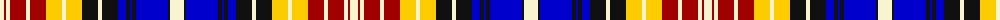

The parent of this is [German](/tartans/ly/8/dr2/ly4/dr16/ly4/dr16/y16/ly4/y16/k16/ly4/k16/b8/k4/b2/k4/b32/k2/ly/14/)

This was sourced from register-of-tartans.  It is a [19 stripes tartan](/stripes/stripes19/).

Original link https://www.tartanregister.gov.uk/tartanDetails.aspx?ref=5900

## Thread count
LY/8 DR2 LY4 DR16 LY4 DR16 Y16 LY4 Y16 K16 LY4 K16 B8 K4 B2 K4 B32 K2 LY/14

## Palette
Each colour and its ΔE from the base-6 reference it is a variant of.

| Colour | Shade | Base | ΔE (OKLab) |
|---|---|---|---|
| B |  `#0000CD` | B  | 0.15 |
| DR |  `#A00000` | R  | 0.09 |
| K |  `#101010` | K  | 0.17 |
| LY |  `#F8F4D0` | W  | 0.04 |
| Y |  `#FCCC00` | Y  | 0.04 |

ID: /variants/ly/8/dr2/ly4/dr16/ly4/dr16/y16/ly4/y16/k16/ly4/k16/b8/k4/b2/k4/b32/k2/ly/14-b0000cd-dra00000-k101010-lyf8f4d0-yfccc00/
