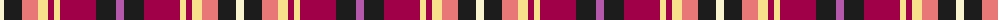

The parent of this is [Khosla, Sarah and Jatin (Personal)](/tartans/ly/8/k18/lr16/lya10/r6/lya6/r36/k20/p/8/)

This was sourced from register-of-tartans.  It is a [9 stripes tartan](/stripes/stripes9/).

Original link https://www.tartanregister.gov.uk/tartanDetails.aspx?ref=11164

## Thread count
LY/8 K18 LR16 LYa10 R6 LYa6 R36 K20 P/8

## Palette
Each colour and its ΔE from the base-6 reference it is a variant of.

| Colour | Shade | Base | ΔE (OKLab) |
|---|---|---|---|
| K |  `#1C1C1C` | B  | 0.20 |
| LR |  `#E87878` | R  | 0.19 |
| LY |  `#F8F4D0` | W  | 0.04 |
| LYa |  `#F8E38C` | Y  | 0.11 |
| P |  `#B458AC` | R  | 0.20 |
| R |  `#A00048` | R  | 0.11 |

ID: /variants/ly/8/k18/lr16/lya10/r6/lya6/r36/k20/p/8-k1c1c1c-lre87878-lyf8f4d0-lyaf8e38c-pb458ac-ra00048/
