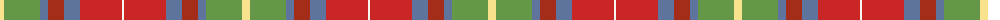
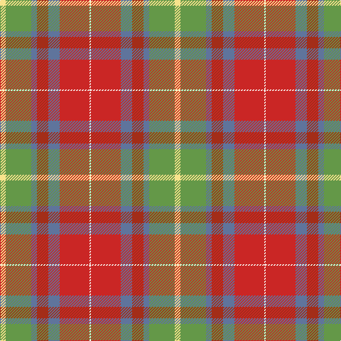

The parent of this is [G P Bathija (Shikarpur, Sindh) Name Tartan Tartan Number: 10690. Earliest known date: 6 September 2012 This tartan was designed in Toronto, Canada by Hans Girdhari Bathija, Esq., born Feb 18, 1969, at Queen Mary's Maternity Home in Hampstead, London, England, United Kingdom. It is designed in honour of Mr. Girdhari Pribhdas Bathija, born to Mr. Pribhdas Jiwandas Bathija and Mrs. Laxmibai Bathija (née Chugh) on Feb. 6, 1940 in Shikarpur, Sindh, India (British) and Mrs. Susan Bathija, née Tan Saw Gaik, born to Mr. Tan Eng Hock and Ooi Cheng Kee on June 7, 1943 in Kampung Jawa, Butterworth, Province Wellesley, Penang, Straits Settlements, UK (Japanese Malai). It is to be worn primarily by their offspring, and their respective families. Other individuals who share the family name Bathija, or who are associated with a Bathija, are also invited to wear this tartan. See products available Copyright © Blair Urquhart, Comrie, 2015](/tartans/ly/8/lg36/b8/ra16/b16/r42/w/2/)

This was sourced from house-of-tartan.  It is a [7 stripes tartan](/stripes/stripes7/).

Original link http://www.house-of-tartan.scotland.net/house/TartanViewjs.asp?colr=Def&tnam=10690

## Thread count
LY/8 LG36 B8 Ra16 B16 R42 W/2

## Palette
Each colour and its ΔE from the base-6 reference it is a variant of.

| Colour | Shade | Base | ΔE (OKLab) |
|---|---|---|---|
| B |  `#5F749C` | B  | 0.17 |
| LG |  `#649848` | G  | 0.19 |
| LY |  `#F8E38C` | Y  | 0.11 |
| R |  `#CA2625` | R  | 0.03 |
| Ra |  `#A32D18` | R  | 0.07 |
| W |  `#F9F5EF` | W  | 0.01 |

# Sample pattern

ID: /variants/ly/8/lg36/b8/ra16/b16/r42/w/2-b5f749c-lg649848-lyf8e38c-rca2625-raa32d18-wf9f5ef/
