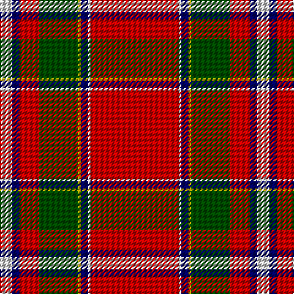

The parent of this is [Drummond of Perth](/tartans/n/10/db6/r16/g32/y2/db6/n2/r/72/)

This was sourced from weddslist.  It is a [8 stripes tartan](/stripes/stripes8/).

Original link http://www.weddslist.com/cgi-bin/tartans/pg.pl?source=rb

## Thread count
N/10 DB6 R16 G32 Y2 DB6 N2 R/72

## Palette
Each colour and its ΔE from the base-6 reference it is a variant of.

| Colour | Shade | Base | ΔE (OKLab) |
|---|---|---|---|
| DB |  `#000064` | B  | 0.17 |
| G |  `#004C00` | G  | 0.08 |
| N |  `#D0D0D0` | W  | 0.11 |
| R |  `#C80000` | R  | 0.00 |
| Y |  `#FFC800` | Y  | 0.04 |

# Sample pattern

ID: /variants/n/10/db6/r16/g32/y2/db6/n2/r/72-db000064-g004c00-nd0d0d0-rc80000-yffc800/
