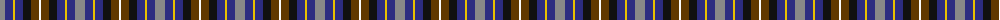
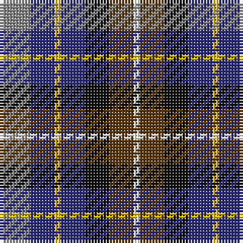

The parent of this is [Devon Companion (District)](/tartans/n/10/db8/y2/db8/k8/t8/w/2/)

This was sourced from tartans-authority.  It is a [7 stripes tartan](/stripes/stripes7/).

Original link http://www.tartansauthority.com/tartan-ferret/display/1283/

## Thread count
N/10 DB8 Y2 DB8 K8 T8 W/2

## Palette
Each colour and its ΔE from the base-6 reference it is a variant of.

| Colour | Shade | Base | ΔE (OKLab) |
|---|---|---|---|
| DB |  `#2C2C80` | B  | 0.05 |
| K |  `#101010` | K  | 0.17 |
| N |  `#888888` | R  | 0.24 |
| T |  `#603800` | G  | 0.16 |
| W |  `#FCFCFC` | W  | 0.03 |
| Y |  `#E8C000` | Y  | 0.00 |

# Sample pattern

ID: /variants/n/10/db8/y2/db8/k8/t8/w/2-db2c2c80-k101010-n888888-t603800-wfcfcfc-ye8c000/
